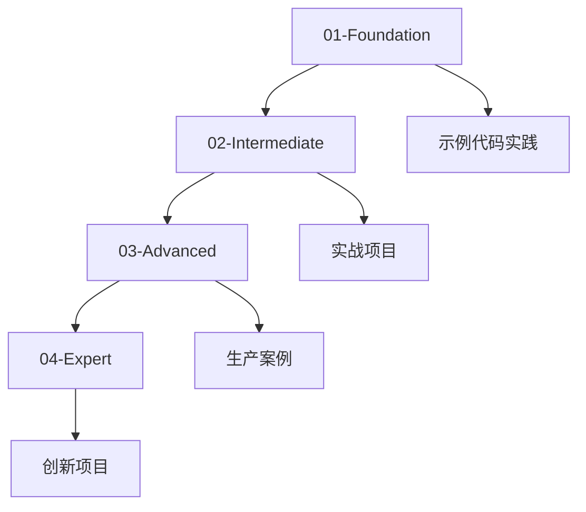

# MCP (Model Context Protocol) 学习模块

> 从零到专家的 MCP 完整学习路径

## 📋 模块概览

本模块将带你系统学习 Model Context Protocol（模型上下文协议），这是 Anthropic 于 2024 年 11 月推出的开源标准，旨在让 AI 应用能够以标准化的方式连接外部数据源和工具。

**学习成果**：完成本模块后，你将能够：
- ✅ 深入理解 MCP 的设计理念和架构
- ✅ 独立开发自定义 MCP 服务器
- ✅ 集成 MCP 到生产环境
- ✅ 优化 MCP 应用的性能和安全性
- ✅ 扩展 MCP 协议满足特定需求

## 🎯 学习路径

### 📘 [01-Foundation - 基础篇](./01-Foundation/)
**目标**：建立扎实的 MCP 基础知识

**时间**：1-2 周  
**难度**：⭐⭐☆☆☆

**主要内容**：
1. **MCP 简介** (`01-introduction.md`)
   - 什么是 MCP？为什么需要它？
   - MCP 解决的核心问题
   - 生态系统概览
   
2. **架构设计** (`02-architecture.md`)
   - 客户端-服务器架构
   - 三大核心组件：Tools、Resources、Prompts
   - 通信协议详解
   
3. **环境搭建** (`03-setup.md`)
   - 开发环境配置
   - 安装 MCP SDK
   - 运行第一个 MCP 服务器

**实践项目**：
- Hello World MCP 服务器
- 简单的文件系统访问工具
- 基础的 API 数据获取资源

---

### 📗 [02-Intermediate - 进阶篇](./02-Intermediate/)
**目标**：掌握 MCP 服务器开发的核心技能

**时间**：2-3 周  
**难度**：⭐⭐⭐☆☆

**主要内容**：
1. **自定义服务器** (`01-custom-server.md`)
   - MCP 服务器开发最佳实践
   - 错误处理与日志
   - 配置管理
   
2. **工具与资源** (`02-tools-resources.md`)
   - 开发强大的 Tools
   - 设计高效的 Resources
   - 参数验证与类型安全
   
3. **提示词系统** (`03-prompts.md`)
   - Prompts 的设计模式
   - 工作流编排
   - 上下文管理

**实战项目**：
- 数据库查询 MCP 服务器
- GitHub 集成服务器
- 天气数据聚合服务

---

### 📕 [03-Advanced - 高级篇](./03-Advanced/)
**目标**：掌握生产环境部署和性能优化

**时间**：1-2 周  
**难度**：⭐⭐⭐⭐☆

**主要内容**：
1. **性能优化** (`01-optimization.md`)
   - 减少 Token 使用（代码执行优化）
   - 缓存策略
   - 批处理与并发
   
2. **安全最佳实践** (`02-security.md`)
   - 认证与授权
   - 数据验证
   - 安全配置
   
3. **生产部署** (`03-production.md`)
   - 容器化部署
   - 监控与告警
   - 故障恢复

**高级项目**：
- 企业级 CRM 集成
- 多租户 MCP 服务
- 高可用 MCP 集群

---

### 📙 [04-Expert - 专家篇](./04-Expert/)
**目标**：成为 MCP 领域的专家

**时间**：1-2 周  
**难度**：⭐⭐⭐⭐⭐

**主要内容**：
1. **协议扩展** (`01-custom-protocol.md`)
   - 扩展 MCP 协议
   - 自定义传输层
   - 协议版本管理
   
2. **企业集成** (`02-integration.md`)
   - 与现有系统集成
   - API 网关模式
   - 微服务架构
   
3. **案例研究** (`03-case-studies.md`)
   - 真实企业案例分析
   - 架构决策解析
   - 最佳实践总结

**专家级项目**：
- 自定义 MCP 协议扩展
- 跨云平台 MCP 网关
- AI Agent 编排系统

---

## 📊 学习建议

### 推荐学习顺序

### 时间分配建议

- **每天学习时间**：1-2 小时
- **理论 vs 实践**：30% 理论 + 70% 实践
- **代码练习**：每个概念至少写 3 个不同的示例

### 学习方法

1. **先理解再实践**
   - 阅读文档理解概念
   - 运行示例代码观察行为
   - 修改代码加深理解

2. **循序渐进**
   - 不要跳过基础章节
   - 确保理解当前内容再进入下一章
   - 遇到困难回顾之前的内容

3. **动手实践**
   - 每学完一个概念就写代码
   - 尝试解决实际问题
   - 记录学习笔记和心得

4. **社区参与**
   - 在 GitHub Discussions 提问
   - 分享你的项目和经验
   - 帮助其他学习者

---

## 🛠️ 开发环境

### 必需工具

- **Node.js** >= 18.0.0
- **npm** 或 **yarn**
- **TypeScript** >= 5.0（推荐）
- **Git** 版本控制

### 推荐工具

- **VS Code** + MCP 相关插件
- **Postman** 或 **HTTPie** - API 测试
- **Docker** - 容器化部署
- **Claude Desktop** - MCP 客户端测试

### 可选工具

- **Python** >= 3.10 - 用于 Python SDK
- **Claude Code** - 命令行集成
- **Cursor** - AI 辅助编程

---

## 📚 推荐资源

### 官方文档
- [Model Context Protocol 官网](https://modelcontextprotocol.io/)
- [MCP GitHub 仓库](https://github.com/modelcontextprotocol)
- [Anthropic 文档](https://docs.anthropic.com/)

### 社区资源
- MCP Discord 社区
- GitHub Discussions
- 技术博客文章

### 视频教程
- Anthropic Academy - MCP 课程
- YouTube 技术讲解
- 开发者会议演讲

---

## 🎓 认证与成就

虽然没有官方认证，但你可以通过以下方式展示你的 MCP 技能：

- ✅ 完成所有章节的学习
- ✅ 实现所有实战项目
- ✅ 贡献开源 MCP 服务器
- ✅ 撰写技术博客分享经验
- ✅ 在生产环境部署 MCP 应用

---

## 💬 获取帮助

遇到问题？有以下途径获取帮助：

1. **查看常见问题**：每个章节末尾都有 FAQ
2. **搜索 Issues**：可能已有人遇到相同问题
3. **提问 Discussion**：描述问题并提供代码
4. **查阅官方文档**：最权威的信息来源

---

## 🚀 开始学习

准备好了吗？让我们从基础篇开始：

👉 [进入 01-Foundation - 基础篇](./01-Foundation/)

---

**祝你学习愉快！记住：最好的学习方式就是动手实践！** 💪